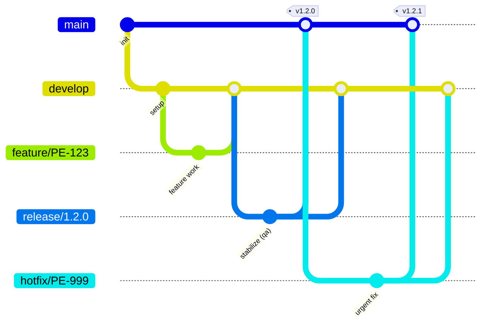

# 03 · Gestión de Cambios

**Handbook de Estándares de Ingeniería — Ancient**

Este módulo define cómo se organizan, versionan y promueven los cambios de código en Ancient: el modelo de branching, las convenciones de commits, la estrategia de merge, el manejo de releases, y la protección de ramas.

---

## 1. Modelo de Branching — GitFlow

**[ESTÁNDAR]** El modelo de branching de Ancient es **GitFlow**. Se elige GitFlow porque el despliegue se hace por promoción entre ambientes (`dev` → `qa` → `prod`) con ramas de release que permiten estabilizar una versión antes de llevarla a producción.

**Ramas permanentes:**

| Rama | Propósito | Ambiente |
|------|-----------|----------|
| `main` | Refleja producción. Cada commit es una versión liberada y etiquetada (tag). | `prod` |
| `develop` | Rama de integración. Consolida los cambios listos para el próximo release. | `dev` |

**Ramas temporales:**

| Rama | Nace de | Se integra en | Propósito |
|------|---------|---------------|-----------|
| `feature/*` | `develop` | `develop` | Nueva funcionalidad |
| `fix/*` | `develop` | `develop` | Corrección de bug (no urgente) |
| `release/*` | `develop` | `main` y `develop` | Estabilización de una versión antes de producción |
| `hotfix/*` | `main` | `main` y `develop` | Corrección urgente directa a producción |



### 1.1 Mapeo branching → despliegue

**[ESTÁNDAR]** El flujo de despliegue sigue las ramas:

| Evento | Ambiente destino | Deploy |
|--------|------------------|--------|
| Merge a `develop` | `dev` | Automático |
| Rama `release/*` | `qa` | Automático o manual (TL aprueba) |
| Merge a `main` (tag de versión) | `prod` | Manual con aprobación del TL |

---

## 2. Naming de Branches

**[ESTÁNDAR]**

```
<tipo>/<TICKET-ID>-<descripcion-breve>
```

| Tipo | Cuándo se usa | Ejemplo |
|------|--------------|---------|
| `feature/` | Nueva funcionalidad | `feature/PE-123-customer-validation` |
| `fix/` | Corrección de bug | `fix/PE-456-timeout-on-payment` |
| `release/` | Preparación de una versión | `release/1.2.0` |
| `hotfix/` | Fix urgente directo a producción | `hotfix/PE-789-critical-auth-bypass` |
| `chore/` | Mantenimiento, dependencias, config | `chore/PE-012-update-nestjs-v11` |
| `refactor/` | Refactoring sin cambio funcional | `refactor/PE-345-extract-payment-service` |

**Reglas:**
- Siempre en minúsculas. No `Feature/`, no `FEAT/`, no `Feat/`.
- Siempre con ID de ticket si existe. Si no hay ticket (chore interno), usar descripción: `chore/update-eslint-config`.
- Ramas `release/*` se nombran con la versión que preparan (`release/1.2.0`).
- Descripción en kebab-case, máximo 5 palabras.
- No ramas con nombre de persona ni ramas autogeneradas fuera de convención.

---

## 3. Conventional Commits

### 3.1 Formato

**[ESTÁNDAR]**

```
<tipo>(alcance opcional): descripción breve

[cuerpo opcional]

[footer opcional: BREAKING CHANGE, refs, etc.]
```

**Tipos permitidos:**

| Tipo | Semver | Uso |
|------|--------|-----|
| `feat` | minor | Nueva funcionalidad visible para el usuario |
| `fix` | patch | Corrección de bug |
| `docs` | — | Solo documentación |
| `style` | — | Formateo, whitespace (sin cambio de lógica) |
| `refactor` | — | Cambio de código que no es feat ni fix |
| `test` | — | Agregar o corregir tests |
| `chore` | — | Mantenimiento, dependencias, CI config |
| `perf` | patch | Mejora de rendimiento |
| `ci` | — | Cambios en pipeline/CI config |
| `build` | — | Cambios en build system |
| `revert` | — | Revertir un commit anterior |

**Ejemplos:**
```
feat(customers): add email validation on registration
fix(payments): resolve timeout on concurrent transactions
chore: update NestJS to v11.0.1
docs(api): update Swagger annotations for /transactions
test(auth): add integration tests for JWT refresh flow
feat(dashboard)!: redesign KPI layout

BREAKING CHANGE: dashboard API response format changed
```

### 3.2 Enforcement automático

**[ESTÁNDAR]** Conventional Commits se enforcea con herramientas, no con buena voluntad.

**Configuración obligatoria en todo repo:**

```json
// package.json
{
  "devDependencies": {
    "@commitlint/cli": "^19.x",
    "@commitlint/config-conventional": "^19.x",
    "husky": "^9.x"
  }
}
```

```js
// commitlint.config.js
module.exports = { extends: ['@commitlint/config-conventional'] };
```

```sh
# .husky/commit-msg
npx --no -- commitlint --edit "$1"
```

### 3.3 Semantic Release

**[RECOMENDADO]** Para repos que generan artefactos versionados (APIs, librerías, MFEs), usar `semantic-release` para automatizar versionado y changelog basado en los commits, disparado al integrar en `main`.

```json
// .releaserc.json
{
  "branches": ["main"],
  "plugins": [
    "@semantic-release/commit-analyzer",
    "@semantic-release/release-notes-generator",
    "@semantic-release/changelog",
    "@semantic-release/npm",
    "@semantic-release/git"
  ]
}
```

---

## 4. Estrategia de Merge

**[ESTÁNDAR]** La estrategia de merge sigue el modelo GitFlow:

| Integración | Método | Nota |
|-------------|--------|------|
| `feature/*` → `develop` | Squash and merge | Un commit limpio por feature en `develop`. |
| `fix/*` → `develop` | Squash and merge | Igual que feature. |
| `release/*` → `main` | Merge commit (`--no-ff`) + tag de versión | Preserva la topología del release y marca el punto exacto liberado a producción. |
| `release/*` → `develop` | Merge commit (`--no-ff`) | Back-merge para no perder los ajustes de estabilización. |
| `hotfix/*` → `main` | Merge commit (`--no-ff`) + tag | Fix urgente liberado y etiquetado. |
| `hotfix/*` → `develop` | Merge commit (`--no-ff`) | Back-merge del hotfix. |

**[ESTÁNDAR]** Toda rama `release/*` y `hotfix/*` que se integra en `main` se etiqueta con la versión correspondiente (`vX.Y.Z`). No hay commit en `main` sin su tag de versión.

---

## 5. Releases y Versionado

**[ESTÁNDAR]** Ancient usa versionado semántico (SemVer: `MAJOR.MINOR.PATCH`):

- **MAJOR:** cambios incompatibles (`BREAKING CHANGE` en commits).
- **MINOR:** nueva funcionalidad retrocompatible (`feat`).
- **PATCH:** correcciones retrocompatibles (`fix`, `perf`).

**Flujo de release:**
1. Se corta `release/X.Y.Z` desde `develop` cuando el alcance del release está completo.
2. En la rama de release solo entran correcciones de estabilización (no features nuevos). Se despliega a `qa`.
3. Al aprobarse, `release/X.Y.Z` se integra en `main` con tag `vX.Y.Z` y se despliega a `prod`.
4. Se hace back-merge de `release/X.Y.Z` a `develop`.

---

## 6. Protección de Branches

**[ESTÁNDAR]**

| Branch | Quién puede integrar | Requisitos |
|--------|---------------------|------------|
| `main` | Solo TL (vía `release/*` o `hotfix/*`) | PR aprobado + checks automáticos pasando (lint, test, Sonar) + tag de versión |
| `develop` | Cualquier dev del pod (vía PR) | PR aprobado por al menos 1 reviewer + checks pasando |
| `release/*`, `hotfix/*` | TL | PR aprobado |

**[ESTÁNDAR]** Nadie hace push directo a `main` ni a `develop`. Todo cambio entra por PR. Sin excepciones, incluyendo hotfixes (que van por PR fast-tracked, no por push directo).

---

## 7. Reglas de PRs

### 7.1 Tamaño

**[RECOMENDADO]** Un PR no debería exceder **400 líneas de código cambiado** (excluyendo archivos generados, lock files, y migraciones). PRs más grandes se dividen en PRs más pequeños y secuenciales.

¿Por qué? Los PRs de 1,000+ líneas no se revisan de verdad — se aprueban por fatiga. Los PRs de 100-300 líneas se revisan en 15-20 minutos con atención real.

### 7.2 Un PR = un propósito

**[RECOMENDADO]** Cada PR resuelve una cosa: un feature, un bug, un refactor, una actualización de dependencias. Los PRs que mezclan un feature con un refactor y una actualización de config son difíciles de revisar y de revertir.

---

*Módulo 03 del Handbook de Estándares de Ingeniería — Ancient.*
