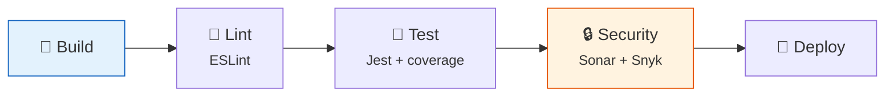

# 07 · Infraestructura y CI/CD

**Handbook de Estándares de Ingeniería — Ancient**

---

## 1. Pipeline Base

### 1.1 Secuencia estándar

**[ESTÁNDAR]** Todo repo con código desplegable tiene un pipeline con al menos estos pasos:

```
build → lint → test (con coverage) → security scan → deploy
```



### 1.2 Qué bloquea vs. qué informa

**[ESTÁNDAR]**

| Paso | Bloqueante (falla = no merge/deploy) | Informativo (warning) |
|------|--------------------------------------|----------------------|
| Build | ✅ Siempre | — |
| Lint | ✅ Errores de lint | ⚠️ Warnings de lint |
| Tests | ✅ Tests fallidos | — |
| Cobertura | ✅ Por debajo del umbral | — |
| Sonar quality gate | ✅ Bugs/vulnerabilidades nuevas | ⚠️ Duplicación, maintainability |
| Snyk (vulnerabilidades) | ✅ Críticas y altas | ⚠️ Medias y bajas |

---

## 2. Proveedor de CI/CD

### 2.1 Proveedor único

**[ESTÁNDAR]** Ancient usa un único proveedor de CI/CD estandarizado (GitHub Actions o GitLab CI) para todos los repos. Un proveedor único evita duplicación de esfuerzo, mantiene el conocimiento del equipo concentrado, y permite estandarizar los pipelines.

### 2.2 Pipeline templates reutilizables

**[ESTÁNDAR]** Los repos consumen templates de pipeline reutilizables (`ancient-pipeline-templates`) en lugar de que cada uno defina su pipeline desde cero. Un cambio en el template se propaga a todos los repos que lo consumen.

---

## 3. Ambientes

**[ESTÁNDAR]** Todo proyecto tiene como mínimo tres ambientes, alineados al modelo GitFlow (ver módulo 03):

| Ambiente | Propósito | Deploy |
|----------|-----------|--------|
| `dev` | Desarrollo y pruebas del equipo | Automático en merge a `develop` |
| `qa` | QA, demo a cliente, testing de integración | Desde `release/*` (automático o manual, TL aprueba) |
| `prod` | Producción | Manual desde `main` (tag de versión), con aprobación del TL |

**[RECOMENDADO]** Proyectos con integraciones complejas pueden tener ambientes adicionales (staging, sandbox, etc.) según necesidad.

---

## 4. Estrategia de Despliegue

**[ESTÁNDAR]** Despliegue con contenedores Docker + Helm sobre Kubernetes (GKE/EKS) con rollback automático.

**[RECOMENDADO]** Evolucionar hacia:
- Blue-green o canary deployments para servicios críticos (pagos, auth).
- Feature flags para releases graduales.
- Rollback automático si los health checks fallan post-deploy.

---

## 5. Monitoreo y Logging

**[RECOMENDADO]** Stack de monitoreo por nivel de proyecto:

| Nivel | Error tracking | Logging | APM |
|-------|---------------|---------|-----|
| **Básico** (proyectos chicos) | Sentry free tier o Betterstack | CloudWatch / Cloud Logging | — |
| **Medio** (proyectos estándar) | Sentry | Structured logging (Pino/Winston) → CloudWatch/Loki | Básico con CloudWatch |
| **Avanzado** (proyectos críticos/financieros) | Sentry | ELK o Grafana Loki | Datadog o Grafana + Prometheus |

**[ESTÁNDAR]** Independientemente de la herramienta, todo servicio:
- Usa logging estructurado (JSON, no `console.log` en texto libre).
- Incluye correlation IDs para trazar requests entre servicios.
- No loguea datos sensibles (PII, tokens, passwords).

---

## 6. Infra como Plataforma (Self-Service)

**[ESTÁNDAR]** Los devs se autoservicen para tareas de infraestructura comunes mediante templates de Terraform reutilizables (`ancient-infra-templates`) que se instancian con variables del proyecto: crear un ambiente de dev, configurar un pipeline estándar, agregar un secret al vault.

**[RECOMENDADO]** Para solicitudes que exceden el self-service, se canalizan a través del TL (no cada dev directamente a Infra/Cibersec), con un template de solicitud: qué se necesita, para qué proyecto, urgencia, y especificaciones técnicas.

---

*Módulo 07 del Handbook de Estándares de Ingeniería — Ancient.*
